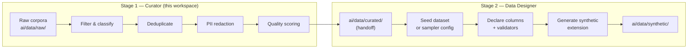

# 🧹 NeMo Curator

**Curate, clean, deduplicate, and filter real-world data before it reaches synthetic generation.**

NeMo Curator is NVIDIA's large-scale data-curation library for cleaning and
refining corpora prior to model training or synthetic data generation. It
complements [NeMo Data Designer](../DataDesigner/) — Curator handles the
*real* side (filter, dedup, PII redaction, quality scoring) and Data Designer
handles the *synthetic* side (declare, generate, validate). The two stages
chain together: Curator outputs become the seed corpora that Data Designer
extends.

> This is a **lightweight scaffold**, not a full clone of
> [NVIDIA/NeMo-Curator](https://github.com/NVIDIA/NeMo-Curator). The upstream
> source is consumed via the `nvcr.io/nvidia/nemo-curator:25.09` container
> image defined in [`docker/docker-compose.nemo-curator.yml`](../../../docker/docker-compose.nemo-curator.yml).
> No vendored copy of the upstream repo lives here.

---

## Curator vs. Data Designer

| Dimension | NeMo Curator | NeMo Data Designer |
|---|---|---|
| **Role** | Refine *real* data | Generate *synthetic* data |
| **Stage** | Stage 1 — clean & curate | Stage 2 — generate & validate |
| **Engine** | Dask + RAPIDS (GPU-accelerated) | Async cell-level pipeline |
| **Inputs** | Raw corpora, scraped text, existing datasets | Curated seeds, samplers, LLM prompts |
| **Outputs** | Filtered, deduplicated, PII-redacted corpora | Synthetic datasets with validators |
| **Key ops** | Filtering, dedup, PII redaction, quality classification, domain classification | Column declaration, dependency-aware generation, LLM-as-judge scoring |
| **Scale** | Billion-document scale via Dask | Per-pipeline, preview-then-generate |
| **Container** | `nvcr.io/nvidia/nemo-curator:25.09` | `pip install data-designer` |
| **Docs** | [docs.nvidia.com/nemo/curator](https://docs.nvidia.com/nemo/curator/latest/about) | [docs.nvidia.com/nemo/datadesigner](https://docs.nvidia.com/nemo/datadesigner/) |

---

## Two-Stage Pipeline



**Handoff path:** Curator writes cleaned corpora to `ai/data/curated/`. Data
Designer reads from there as a seed dataset (or the curated corpus is used
directly for fine-tuning). The `ai/data/curated/` directory is DVC-tracked
per the parent [`ai/README.md`](../../README.md) data-management section.

**Streaming access (no local pull needed):** `ai/data/raw/` is intentionally
empty on the host — raw corpora live on `whitebat:training/pixelated-empathy`
(S3) and are streamed directly via
[`S3Streamer`](../../pipelines/data_processing/extractors/s3_streamer.py)
(`DEFAULT_REMOTE=whitebat`, `DEFAULT_BUCKET=training`,
`DEFAULT_PREFIX=pixelated-empathy`, `rclone cat` streaming). This is the same
path `pix4582_review_extractor.py` uses — Curator jobs should stream from S3
and write only the *curated* output to `ai/data/curated/`, not copy raw data
locally first.

---

## Quick Start

### 1. Prerequisites

- Docker + Docker Compose
- NVIDIA GPU + NVIDIA Container Toolkit (for RAPIDS acceleration)
- `NVIDIA_API_KEY` environment variable (for quality / domain classifiers)

### 2. Bring up the Curator container

The compose file is at the repo root under `docker/`:

```bash
# From the pixelated repo root
docker compose -f docker/docker-compose.nemo-curator.yml up -d nemo-curator
```

This starts an interactive (`tty`) container with:

- `./ai/datasets` → `/workspace/datasets`
- `./ai/pipelines/orchestrator/processing` → `/workspace/scripts`
- `NVIDIA_API_KEY` passed through
- Joined to the external `nemo-network` (shared with other NeMo services)

### 3. Run curation inside the container

```bash
docker exec -it nemo-curator bash

# Inside the container — Curator Python API is preinstalled
python -c "from nemo_curator import ModularClassifier; print('ok')"
```

Curator scripts live at `/workspace/scripts` inside the container (mirrored
from `ai/pipelines/orchestrator/processing` on the host). Curated outputs
should be written under `/workspace/datasets` so they land in `ai/datasets/`
on the host, then promoted to `ai/data/curated/` for the Data Designer
handoff.

---

## Workspace Layout

```
ai/tools/NemoCurator/
├── README.md            # this file
└── configs/
    └── README.md        # placeholder — product configs live at parent path
```

This is intentionally minimal. The upstream NeMo Curator source is **not**
vendored here — it is consumed via the container image. Add Curator pipeline
scripts under `ai/pipelines/orchestrator/processing/` (the host directory
mounted into the container at `/workspace/scripts`).

---

## Product Configs

Curator does **not** carry its own product configs in this workspace. The
product-level dataset configs (therapeutic SFT, CPTSD dialogues, crisis
safety, DPO preferences, knowledge tasks, edge cases, long-running therapy,
plus the bootstrap) live at the parent path:

```
scripts/data/designer/configs/
├── _bootstrap.py
├── therapeutic_sft.py
├── long_running_therapy.py
├── cptsd_dialogues.py
├── edge_cases.py
├── crisis_safety.py
├── dpo_preferences.py
└── knowledge_tasks.py
```

These configs are shared between Curator (which curates the seed corpora)
and Data Designer (which generates synthetic extensions). See
[`configs/README.md`](configs/README.md) for the pointer.

---

## Documentation

- **Curator docs**: <https://docs.nvidia.com/nemo/curator/latest/about>
- **Data Designer docs**: <https://docs.nvidia.com/nemo/datadesigner/>
- **Compose file**: [`docker/docker-compose.nemo-curator.yml`](../../../docker/docker-compose.nemo-curator.yml)
- **Parent AI README**: [`ai/README.md`](../../README.md)
- **Path migration note**: `.agent/internal/data/18-b47b62b1-path-migration.md`

---

## License

NeMo Curator is Apache 2.0 — see the upstream
[NVIDIA/NeMo-Curator](https://github.com/NVIDIA/NeMo-Curator) repository.
This scaffold contains no vendored upstream code.
