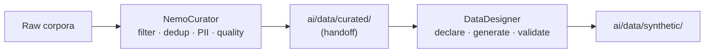

# AI Tools

External tool workspaces and utilities used by the Pixelated Empathy AI
pipeline. Each subdirectory is a tracked scaffold or snapshot — see the
individual README for scope and licensing.

## Workspaces

| Workspace | Purpose | Upstream | Container |
|---|---|---|---|
| [`DataDesigner/`](DataDesigner/) | Synthetic data generation — declare columns, generate, validate | [NVIDIA-NeMo/DataDesigner](https://github.com/NVIDIA-NeMo/DataDesigner) | `pip install data-designer` |
| [`NemoCurator/`](NemoCurator/) | Data curation — filter, dedup, PII redaction, quality scoring | [NVIDIA/NeMo-Curator](https://github.com/NVIDIA/NeMo-Curator) | `nvcr.io/nvidia/nemo-curator:25.09` |
| [`generators/`](generators/) | Local data generators | — | — |
| [`scripts/`](scripts/) | Shell scripts and command-line tools | — | — |
| [`utilities/`](utilities/) | Utility modules (api, core, data, pipelines, pkg_mera) | — | — |

## Two-Stage Data Pipeline

The two NeMo workspaces chain together — Curator cleans real data, Data
Designer generates synthetic extensions:

See [`NemoCurator/README.md`](NemoCurator/README.md) for the full pipeline
diagram and [`DataDesigner/README.md`](DataDesigner/README.md) for the
generation side.

## Notes

- **DataDesigner** is a full repo clone (with `packages/`, `docs/`,
  `pyproject.toml`) because it is developed in-place as an NVIDIA NeMo
  framework. See its `AGENTS.md` for the layering and import-direction
  invariants.
- **NemoCurator** is a lightweight scaffold — the upstream source is
  consumed via the container image defined in
  [`docker/docker-compose.nemo-curator.yml`](../../docker/docker-compose.nemo-curator.yml).
  No vendored copy of the upstream repo lives here.
- Product-level dataset configs are shared and live at
  `scripts/data/designer/configs/` (repo root), not inside either workspace.
